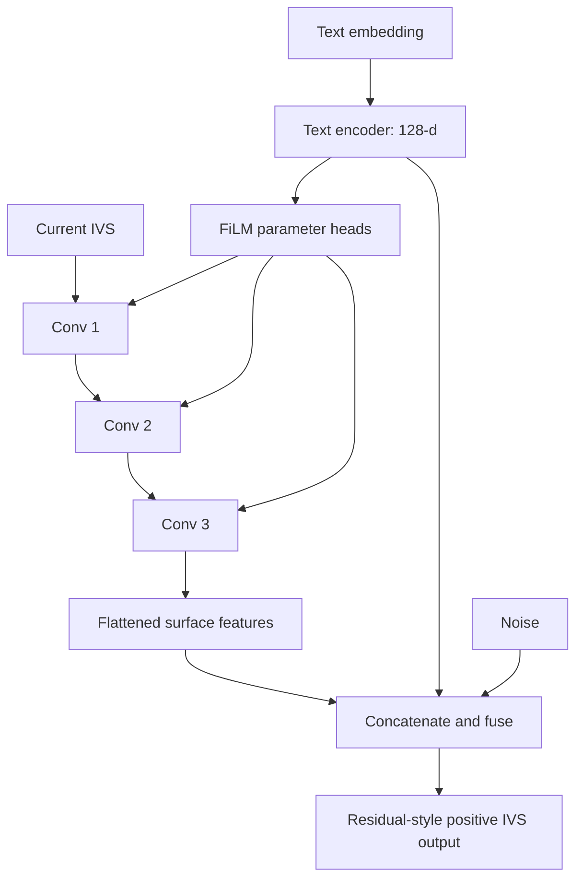

# FiLM Implementation Specification for the Conditional WGAN-GP IVS Forecasting Model

## 1. Status and purpose

This document specifies a correct and testable implementation of Feature-wise Linear Modulation (FiLM) for the conditional WGAN-GP implied-volatility-surface (IVS) forecasting model.

The current generator described in `gan_model_detailed_architecture.md` does **not** contain FiLM. It uses late concatenation of:

1. flattened CNN surface features;
2. a 128-dimensional text representation; and
3. a latent noise vector.

Accordingly, the architecture described below is a **proposed implementation specification**, not a description of the current code. The thesis should claim that the model uses FiLM only after this implementation has been added, tested, and used to produce the reported empirical results.

The proposed design follows the definition of FiLM introduced by [Perez et al. (2018)](https://ojs.aaai.org/index.php/AAAI/article/view/11671): conditioning information generates feature-wise scaling and shifting coefficients that transform intermediate feature maps. The authors' [reference implementation](https://github.com/ethanjperez/film/blob/master/vr/models/filmed_net.py) applies the transformation

\[
\operatorname{FiLM}(\mathbf X;\boldsymbol\gamma,\boldsymbol\beta)
=
\boldsymbol\gamma\odot\mathbf X+\boldsymbol\beta,
\]

with the coefficients broadcast across the spatial dimensions.

## 2. Recommended architectural decision

The recommended first implementation is **generator-only hybrid FiLM**:

- apply FiLM to all three convolutional layers of the generator surface encoder;
- derive the FiLM parameters only from the encoded textual information;
- retain the existing late concatenation of surface features, text features, and noise;
- retain the existing fully connected fusion head and residual-style output;
- leave the conditional critic unchanged; and
- leave the WGAN-GP, reconstruction, calendar, butterfly, and smoothness losses unchanged.

This design is recommended because it introduces the intended layer-wise text conditioning while preserving the existing global text-conditioning pathway. It is also a controlled architectural change: the effect of FiLM can be compared directly with the current concatenation-only baseline without simultaneously changing the critic or loss functions.

The proposed model is therefore a hybrid of:

1. **intermediate conditioning**, through FiLM inside the CNN surface encoder; and
2. **late conditioning**, through concatenation before the fusion MLP.



## 3. Inputs and notation

For a minibatch of size \(B\), the generator receives:

- current IVS: \(\boldsymbol\sigma_t\in\mathbb R^{B\times1\times H\times W}\);
- text embedding: \(\mathbf w_t\in\mathbb R^{B\times E}\); and
- noise: \(\mathbf z_t\in\mathbb R^{B\times Z}\).

Here:

- \(H\) is the number of maturity bins;
- \(W\) is the number of strike or moneyness bins;
- \(E\) is the external text-embedding dimension; and
- \(Z\) is the noise dimension, equal to 32 in the current default configuration.

The generator text encoder remains:

\[
E
\rightarrow256
\rightarrow\operatorname{LayerNorm}(256)
\rightarrow\operatorname{LeakyReLU}(0.2)
\rightarrow\operatorname{Dropout}(0.1)
\rightarrow128
\rightarrow\operatorname{LeakyReLU}(0.2).
\]

Its output is denoted by

\[
\mathbf h_t^w
=
f_{\mathrm{text}}(\mathbf w_t;\theta_{\mathrm{text}})
\in\mathbb R^{B\times128}.
\]

The same encoded vector \(\mathbf h_t^w\) serves two purposes:

1. it generates the FiLM coefficients for the convolutional layers; and
2. it remains part of the final concatenated fusion vector.

## 4. Mathematical definition of the FiLM-conditioned surface encoder

### 4.1 Convolutional pre-activations

Let \(\mathbf H_t^{(0)}=\boldsymbol\sigma_t\). For convolutional layer \(\ell\), define the pre-activation feature map

\[
\mathbf A_t^{(\ell)}
=
\operatorname{Conv}^{(\ell)}
\left(\mathbf H_t^{(\ell-1)}\right)
\in
\mathbb R^{B\times C_\ell\times H_\ell\times W_\ell}.
\]

The generator uses three layers with

\[
(C_1,C_2,C_3)=(32,64,128).
\]

### 4.2 Text-dependent FiLM parameters

For each layer \(\ell\), a separate linear FiLM head maps the text representation into \(2C_\ell\) parameters. For observation \(b\) in the minibatch,

\[
\begin{bmatrix}
\Delta\boldsymbol\gamma_{t,b}^{(\ell)}\\
\boldsymbol\beta_{t,b}^{(\ell)}
\end{bmatrix}
=
\mathbf W_{\mathrm{FiLM}}^{(\ell)}\mathbf h_{t,b}^w
+
\mathbf b_{\mathrm{FiLM}}^{(\ell)},
\]

where

\[
\mathbf W_{\mathrm{FiLM}}^{(\ell)}
\in\mathbb R^{2C_\ell\times128},
\qquad
\mathbf b_{\mathrm{FiLM}}^{(\ell)}
\in\mathbb R^{2C_\ell}.
\]

Equivalently, if the batch of text representations is stored row-wise as
\(\mathbf H_t^w\in\mathbb R^{B\times128}\), the implementation computes

\[
\mathbf P_t^{(\ell)}
=
\mathbf H_t^w
\left(\mathbf W_{\mathrm{FiLM}}^{(\ell)}\right)^\top
+
\mathbf 1_B
\left(\mathbf b_{\mathrm{FiLM}}^{(\ell)}\right)^\top
\in\mathbb R^{B\times2C_\ell}.
\]

This batched form is the operation performed by a PyTorch `Linear(128, 2*C_l)` layer.

The vectors are split into

\[
\Delta\boldsymbol\gamma_t^{(\ell)},
\boldsymbol\beta_t^{(\ell)}
\in\mathbb R^{B\times C_\ell}.
\]

For stable identity initialization, define

\[
\boldsymbol\gamma_t^{(\ell)}
=
\mathbf 1+
\Delta\boldsymbol\gamma_t^{(\ell)}.
\]

The \(1+\Delta\gamma\) parameterization is an implementation choice, not a change to the FiLM definition. It allows all FiLM-head weights and biases to be initialized at zero, so the initial transformation is exactly the identity:

\[
\boldsymbol\gamma_t^{(\ell)}=\mathbf1,
\qquad
\boldsymbol\beta_t^{(\ell)}=\mathbf0.
\]

An equivalent alternative is to generate \(\gamma\) directly, initialize its bias to one, and initialize the \(\beta\) bias to zero. The \(1+\Delta\gamma\) form is less error-prone and is recommended here.

### 4.3 Channel-wise affine modulation

The FiLM parameters are reshaped to

\[
\boldsymbol\gamma_t^{(\ell)},
\boldsymbol\beta_t^{(\ell)}
\in
\mathbb R^{B\times C_\ell\times1\times1}
\]

and broadcast across \(H_\ell\) and \(W_\ell\). The modulated feature map is

\[
\widetilde{\mathbf A}_t^{(\ell)}
=
\boldsymbol\gamma_t^{(\ell)}
\odot
\mathbf A_t^{(\ell)}
+
\boldsymbol\beta_t^{(\ell)}.
\]

The activation is then applied:

\[
\mathbf H_t^{(\ell)}
=
\operatorname{LeakyReLU}_{0.2}
\left(
\widetilde{\mathbf A}_t^{(\ell)}
\right).
\]

Thus, the required operation order in the current generator is:

\[
\boxed{
\operatorname{Conv}
\rightarrow
\operatorname{FiLM}
\rightarrow
\operatorname{LeakyReLU}
}
\]

The generator currently has no normalization layer in its surface encoder. If normalization is introduced later, the recommended order is

\[
\operatorname{Conv}
\rightarrow
\operatorname{Normalization}
\rightarrow
\operatorname{FiLM}
\rightarrow
\operatorname{Activation}.
\]

### 4.4 Important interpretation

The proposed FiLM coefficients are **sample-specific and channel-specific**, but they are constant across the spatial grid within a feature channel. Therefore, FiLM does not directly assign a different coefficient to each maturity--strike cell.

It is accurate to say that text can amplify or suppress CNN channels encoding, for example, short-maturity or curvature-related patterns. It is not accurate to claim that channel-wise FiLM directly reweights individual maturity or strike locations unless the model is changed to generate spatially varying modulation maps.

## 5. Layer-by-layer generator architecture

### 5.1 Layer 1

\[
\mathbf A_t^{(1)}
=
\operatorname{Conv2d}_{1\rightarrow32}
\left(
\boldsymbol\sigma_t;
k=3,s=1,p=1
\right),
\]

\[
\mathbf H_t^{(1)}
=
\operatorname{LeakyReLU}_{0.2}
\left[
\operatorname{FiLM}_1
\left(
\mathbf A_t^{(1)},\mathbf h_t^w
\right)
\right].
\]

Shape:

\[
[B,1,H,W]
\rightarrow
[B,32,H,W].
\]

The FiLM head produces \(2\times32=64\) values per observation.

### 5.2 Layer 2

\[
\mathbf A_t^{(2)}
=
\operatorname{Conv2d}_{32\rightarrow64}
\left(
\mathbf H_t^{(1)};
k=3,s=2,p=1
\right),
\]

\[
\mathbf H_t^{(2)}
=
\operatorname{LeakyReLU}_{0.2}
\left[
\operatorname{FiLM}_2
\left(
\mathbf A_t^{(2)},\mathbf h_t^w
\right)
\right].
\]

Exact shape:

\[
[B,32,H,W]
\rightarrow
[B,64,\lceil H/2\rceil,\lceil W/2\rceil].
\]

The FiLM head produces \(2\times64=128\) values per observation.

### 5.3 Layer 3

\[
\mathbf A_t^{(3)}
=
\operatorname{Conv2d}_{64\rightarrow128}
\left(
\mathbf H_t^{(2)};
k=3,s=2,p=1
\right),
\]

\[
\mathbf H_t^{(3)}
=
\operatorname{LeakyReLU}_{0.2}
\left[
\operatorname{FiLM}_3
\left(
\mathbf A_t^{(3)},\mathbf h_t^w
\right)
\right].
\]

Exact shape:

\[
[B,64,\lceil H/2\rceil,\lceil W/2\rceil]
\rightarrow
[B,128,\lceil H/4\rceil,\lceil W/4\rceil].
\]

The FiLM head produces \(2\times128=256\) values per observation.

### 5.4 Default 16 by 16 grid

For \(H=W=16\), the modulated surface encoder retains the current shape progression:

\[
[B,1,16,16]
\rightarrow
[B,32,16,16]
\rightarrow
[B,64,8,8]
\rightarrow
[B,128,4,4].
\]

After flattening,

\[
\mathbf h_t^{\sigma\mid w}
=
\operatorname{vec}\left(\mathbf H_t^{(3)}\right)
\in\mathbb R^{B\times2048}.
\]

The notation \(\mathbf h_t^{\sigma\mid w}\) emphasizes that the surface representation has already been conditioned on the text through FiLM.

## 6. Fusion head and output

The recommended hybrid design retains the original late-fusion vector:

\[
\mathbf u_t
=
\left[
\mathbf h_t^{\sigma\mid w};
\mathbf h_t^w;
\mathbf z_t
\right].
\]

Under the default configuration,

\[
\dim(\mathbf u_t)
=
2048+128+32
=
2208.
\]

Therefore, the existing fusion MLP remains unchanged:

\[
2208
\rightarrow512
\rightarrow512
\rightarrow HW.
\]

It produces a pre-softplus surface adjustment \(\boldsymbol\Delta_t\), and the final output remains

\[
\boldsymbol\sigma_{t+h}^{G}
=
\operatorname{softplus}
\left(
\boldsymbol\sigma_t+
\boldsymbol\Delta_t
\right)
+10^{-4}.
\]

The full generator parameter set is

\[
\theta_g
=
\left(
\theta_{g,\mathrm{surf}},
\theta_{g,\mathrm{text}},
\theta_{g,\mathrm{FiLM}},
\theta_{g,\mathrm{fuse}}
\right).
\]

There is no independent convolutional decoder and no \(\theta_{\mathrm{dec}}\) in this design.

## 7. Additional parameter count

Each FiLM head is a linear layer from 128 to \(2C_\ell\). The additional trainable parameter counts are:

| Layer | Channels \(C_\ell\) | FiLM output | Weights and biases | Additional parameters |
|---|---:|---:|---:|---:|
| Conv 1 | 32 | 64 | \(128\times64+64\) | 8,256 |
| Conv 2 | 64 | 128 | \(128\times128+128\) | 16,512 |
| Conv 3 | 128 | 256 | \(128\times256+256\) | 33,024 |
| **Total** |  |  |  | **57,792** |

The fusion-head input dimension does not change in the recommended hybrid design.

## 8. PyTorch reference implementation

### 8.1 Reusable FiLM layer

```python
import torch
import torch.nn as nn


class FiLM2d(nn.Module):
    """Channel-wise FiLM for a [B, C, H, W] feature tensor."""

    def __init__(self, condition_dim: int, num_channels: int) -> None:
        super().__init__()
        self.condition_dim = condition_dim
        self.num_channels = num_channels
        self.to_delta_gamma_beta = nn.Linear(
            condition_dim,
            2 * num_channels,
        )

        # Identity initialization: gamma = 1 and beta = 0.
        nn.init.zeros_(self.to_delta_gamma_beta.weight)
        nn.init.zeros_(self.to_delta_gamma_beta.bias)

    def forward(
        self,
        features: torch.Tensor,
        condition: torch.Tensor,
    ) -> torch.Tensor:
        if features.ndim != 4:
            raise ValueError(
                f"features must have shape [B, C, H, W], got {features.shape}"
            )
        if condition.ndim != 2:
            raise ValueError(
                f"condition must have shape [B, D], got {condition.shape}"
            )
        if features.shape[0] != condition.shape[0]:
            raise ValueError("features and condition must have the same batch size")
        if features.shape[1] != self.num_channels:
            raise ValueError(
                f"expected {self.num_channels} channels, got {features.shape[1]}"
            )

        parameters = self.to_delta_gamma_beta(condition)
        delta_gamma, beta = parameters.chunk(2, dim=1)
        gamma = (1.0 + delta_gamma).to(dtype=features.dtype)
        beta = beta.to(dtype=features.dtype)

        gamma = gamma[:, :, None, None]
        beta = beta[:, :, None, None]
        return gamma * features + beta
```

### 8.2 Generator integration

```python
from typing import Optional

import torch
import torch.nn as nn
import torch.nn.functional as F


class FiLMGenerator(nn.Module):
    def __init__(
        self,
        embedding_dim: int,
        height: int,
        width: int,
        noise_dim: int = 32,
        hidden_dim: int = 512,
    ) -> None:
        super().__init__()
        self.height = height
        self.width = width
        self.noise_dim = noise_dim

        self.text_encoder = nn.Sequential(
            nn.Linear(embedding_dim, 256),
            nn.LayerNorm(256),
            nn.LeakyReLU(0.2),
            nn.Dropout(0.1),
            nn.Linear(256, 128),
            nn.LeakyReLU(0.2),
        )

        self.conv1 = nn.Conv2d(1, 32, kernel_size=3, stride=1, padding=1)
        self.conv2 = nn.Conv2d(32, 64, kernel_size=3, stride=2, padding=1)
        self.conv3 = nn.Conv2d(64, 128, kernel_size=3, stride=2, padding=1)

        self.film1 = FiLM2d(condition_dim=128, num_channels=32)
        self.film2 = FiLM2d(condition_dim=128, num_channels=64)
        self.film3 = FiLM2d(condition_dim=128, num_channels=128)
        self.activation = nn.LeakyReLU(0.2)

        encoded_h = self._conv_out(self._conv_out(height, 2), 2)
        encoded_w = self._conv_out(self._conv_out(width, 2), 2)
        surface_feature_dim = 128 * encoded_h * encoded_w
        fusion_dim = surface_feature_dim + 128 + noise_dim

        self.fusion_head = nn.Sequential(
            nn.Linear(fusion_dim, hidden_dim),
            nn.LeakyReLU(0.2),
            nn.Linear(hidden_dim, hidden_dim),
            nn.LeakyReLU(0.2),
            nn.Linear(hidden_dim, height * width),
        )

    @staticmethod
    def _conv_out(size: int, stride: int) -> int:
        # kernel_size=3, padding=1, dilation=1
        return (size + 2 - 3) // stride + 1

    def forward(
        self,
        current_surface: torch.Tensor,
        text_embedding: torch.Tensor,
        noise: Optional[torch.Tensor] = None,
    ) -> torch.Tensor:
        batch_size = current_surface.shape[0]
        text_features = self.text_encoder(text_embedding)

        x = self.conv1(current_surface)
        x = self.activation(self.film1(x, text_features))

        x = self.conv2(x)
        x = self.activation(self.film2(x, text_features))

        x = self.conv3(x)
        x = self.activation(self.film3(x, text_features))
        surface_features = x.flatten(start_dim=1)

        if noise is None:
            noise = torch.randn(
                batch_size,
                self.noise_dim,
                device=surface_features.device,
                dtype=surface_features.dtype,
            )
        else:
            expected_noise_shape = (batch_size, self.noise_dim)
            if tuple(noise.shape) != expected_noise_shape:
                raise ValueError(
                    f"noise must have shape {expected_noise_shape}, got {noise.shape}"
                )
            noise = noise.to(
                device=surface_features.device,
                dtype=surface_features.dtype,
            )

        fused = torch.cat(
            [surface_features, text_features, noise],
            dim=1,
        )
        delta = self.fusion_head(fused).view(
            batch_size,
            1,
            self.height,
            self.width,
        )
        return F.softplus(current_surface + delta) + 1e-4
```

The code above is a reference implementation rather than a drop-in patch. The final implementation should reuse the project's existing convolution-output-size helper and, where possible, preserve the existing module names and state-dictionary keys. In particular, the current surface encoder may need to be executed layer by layer rather than renamed wholesale, so that old convolutional weights remain loadable.

## 9. Critic and losses

### 9.1 Critic

The recommended first implementation leaves the critic unchanged. It should continue to receive:

- the current surface;
- the candidate future surface; and
- the text embedding.

The current critic is already conditional because it concatenates the current and candidate surfaces and separately encodes the text before its scoring head. Adding FiLM to the critic at the same time would make it difficult to identify whether any empirical change is caused by the generator or critic modification.

FiLM conditioning in the critic may be investigated later as a separate ablation. If it is added, the WGAN-GP gradient must still be taken with respect to the interpolated candidate future surface while the current surface and text conditioning are held fixed.

### 9.2 Training objective

Adding FiLM does not change the current loss functions. The generator loss remains

\[
\mathcal L_G
=
\mathcal L_{\mathrm{adv}}
+
\lambda_{\mathrm{recon}}\mathcal L_{\mathrm{recon}}
+
\lambda_{\mathrm{cal}}\mathcal L_{\mathrm{cal}}
+
\lambda_{\mathrm{bfly}}\mathcal L_{\mathrm{bfly}}
+
\lambda_{\mathrm{smooth}}\mathcal L_{\mathrm{smooth}}.
\]

Writing the current surface and text condition explicitly, the critic loss remains

\[
\mathcal L_D
=
\mathbb E\left[
D(\boldsymbol\sigma_{t+h}^{G},\boldsymbol\sigma_t,\mathbf w_t)
\right]
-
\mathbb E\left[
D(\boldsymbol\sigma_{t+h},\boldsymbol\sigma_t,\mathbf w_t)
\right]
+
\lambda_{\mathrm{gp}}
\mathbb E
\left[
\left(
\left\|
\nabla_{\widehat{\boldsymbol\sigma}_{t+h}}
D(\widehat{\boldsymbol\sigma}_{t+h},\boldsymbol\sigma_t,\mathbf w_t)
\right\|_2
-1
\right)^2
\right].
\]

FiLM does not itself impose smoothness or no-arbitrage conditions. Those properties remain governed by the structural penalty terms.

## 10. Configuration changes

Recommended configuration fields are:

```yaml
generator:
  conditioning: film_concat
  film:
    enabled: true
    layers: [1, 2, 3]
    identity_init: true
    keep_text_in_fusion: true
model_arch_version: 2
```

The implementation should validate that:

- the FiLM condition dimension is derived from, and therefore matches, the output dimension of the generator text encoder;
- every requested FiLM layer has a corresponding parameter head;
- `keep_text_in_fusion: true` preserves the 2208-dimensional default fusion input; and
- disabling FiLM recovers the existing concatenation-only architecture.

For reproducible experiments, the conditioning mode should be saved in every checkpoint and exported configuration.

## 11. Checkpoint compatibility

Old concatenation-only checkpoints do not contain FiLM-head parameters. They may be loaded into the new generator only through an explicit migration path:

1. instantiate the FiLM generator with identity-initialized FiLM heads;
2. load the old checkpoint with non-strict loading;
3. verify that the only missing keys belong to `film1`, `film2`, and `film3`; and
4. reject the checkpoint if any existing surface, text, fusion, or output parameter is missing or mismatched.

Because identity-initialized FiLM leaves the convolutional features unchanged, an old model loaded in evaluation mode should reproduce the original generator output up to numerical precision when supplied with the same surface, text, and noise.

The migration code must log all missing and unexpected keys. It should not silently ignore arbitrary parameter mismatches.

The old optimizer and scheduler states should normally not be restored because the generator parameter set has changed. Load the model weights, initialize the FiLM parameters, and then construct new optimizer and scheduler instances. Every new checkpoint should store `model_arch_version`, the conditioning mode, the set of FiLM-equipped layers, and whether late text concatenation is retained.

For a FiLM-only ablation, the fusion input changes from 2208 to

\[
2048+32=2080.
\]

Consequently, the first fusion-layer weight matrix is shape-incompatible with the concatenation baseline. Such a model should be treated as a separate architecture or warm start, not as an exactly compatible checkpoint migration.

## 12. Required tests

### 12.1 FiLM unit tests

1. **Shape preservation**
   - input: `[B, C, H, W]` and condition `[B, 128]`;
   - expected output: `[B, C, H, W]`.

2. **Identity initialization**
   - immediately after initialization, verify
     `max_abs(FiLM(x, c) - x) < 1e-6`.

3. **Broadcast correctness**
   - verify that each channel uses one scale and one shift shared across its spatial cells;
   - verify that different samples in a batch may receive different coefficients.

4. **Gradient flow**
   - after backpropagation, verify finite, non-null gradients for the FiLM-head weights;
   - verify that gradients reach the text encoder through both the FiLM and late-fusion pathways.

   With zero-initialized FiLM-head weights, the first backward pass can produce gradients for the FiLM projection while the derivative from the FiLM branch to the text representation is initially zero. This is expected. In the recommended hybrid model, the late-fusion pathway still supplies a text-encoder gradient from the first update.

5. **Input validation**
   - reject incorrect feature rank, condition rank, batch size, or channel count.

### 12.2 Generator integration tests

1. Generator output retains shape `[B, 1, H, W]`.
2. All generated values are strictly positive.
3. With fixed surface, text, and noise, evaluation-mode outputs are deterministic.
4. At identity initialization, the FiLM model reproduces the concatenation-only baseline when shared weights are identical.
5. After a training update, at least one FiLM parameter changes from its identity value.
6. After training, changing the text while holding the surface and noise fixed changes the output.
7. Both even and odd grid sizes produce the correct flattened dimension.
8. No NaN or infinite values appear in FiLM parameters, generator output, or loss terms.
9. With `film.enabled: false`, the generator exactly recovers the concatenation-only execution path.
10. Saving and reloading a FiLM checkpoint reproduces the same evaluation output for fixed inputs.

### 12.3 Training integration tests

1. The critic still returns `[B, 1]` without sigmoid.
2. The gradient penalty is computed only with respect to the interpolated candidate future surface.
3. The generator and critic update schedules remain unchanged.
4. Validation and checkpoint selection continue to use the intended metrics.
5. Saved checkpoints record the architecture and conditioning mode.

### 12.4 WGAN-GP interaction tests

1. During a critic update, detach the generated surface before it is passed to the critic; generator and FiLM parameters must not receive critic-step gradients.
2. Draw the interpolation coefficient with shape `[B, 1, 1, 1]` so that it is broadcast across each surface.
3. Compute the gradient penalty with respect to the interpolated future surface only, holding the current surface and text fixed.
4. Use `create_graph=True` when constructing the gradient penalty required for critic backpropagation.
5. During a generator update, gradients must pass through the critic score to the generator and FiLM heads; do not wrap the critic forward pass in `torch.no_grad()`.
6. Do not include the WGAN gradient penalty in the generator step. Any FiLM-coefficient or generator-gradient regularization must be specified separately.

## 13. Monitoring and diagnostics

During training, record the following statistics for each FiLM layer:

- mean and standard deviation of \(\gamma\);
- minimum and maximum of \(\gamma\);
- mean and standard deviation of \(\beta\);
- norm of the FiLM-head gradients; and
- norm of the text-encoder gradients.

Healthy initialization should begin near

\[
\mathbb E[\gamma]\approx1,
\qquad
\mathbb E[\beta]\approx0.
\]

Large or rapidly diverging coefficients may indicate excessive learning rates, unstable text representations, or over-conditioning. Coefficient clipping is not recommended as a default. If instability is observed, first consider a lower FiLM-head learning rate, gradient clipping, weaker text dropout, or a small regularization term on \(\Delta\gamma\) and \(\beta\).

## 14. Required ablation study

At minimum, compare the following models using the same data splits and training protocol:

| Model | Intermediate FiLM | Text in final concatenation | Purpose |
|---|---:|---:|---|
| Concatenation baseline | No | Yes | Current implementation |
| FiLM only | Yes | No | Isolate FiLM as the sole text-conditioning path |
| Hybrid FiLM + concatenation | Yes | Yes | Recommended implementation |

Report:

- validation and test reconstruction error;
- calendar-arbitrage penalty;
- butterfly-arbitrage penalty;
- smoothness measure;
- relevant surface-level forecast metrics;
- model parameter count;
- training stability across random seeds; and
- sensitivity of outputs to changes in text and noise.

Include a no-text or shuffled-text control. In the shuffled-text test, randomly permute the correspondence between text embeddings and IVSs while holding the surfaces and other inputs fixed. A genuinely text-conditioned model should exhibit a measurable deterioration in forecast quality or conditional consistency when the text alignment is destroyed.

Because the hybrid model adds 57,792 parameters, the comparison should report parameter counts and, where feasible, include a parameter-matched concatenation baseline.

## 15. Risks and limitations

### 15.1 Weak use of noise

The strong reconstruction loss may still cause the generator to use \(\mathbf z_t\) only weakly. FiLM improves text conditioning but does not solve latent-noise collapse.

### 15.2 Channel-wise, not spatial, conditioning

Standard FiLM applies one coefficient per feature channel. It can influence spatial patterns represented within a channel but does not directly generate maturity-specific or strike-specific coefficients.

### 15.3 Over-conditioning

Applying FiLM at all three convolutional layers gives text a strong influence over the surface representation. Identity initialization and coefficient monitoring are therefore important.

### 15.4 Soft structural constraints

FiLM does not guarantee arbitrage-free outputs. The calendar and butterfly terms remain soft penalties, and the implementation must not be described as guaranteeing strict no-arbitrage unless a hard constraint or arbitrage-free parameterization is introduced.

### 15.5 Text dropout

The existing text encoder contains dropout. Consequently, FiLM coefficients are stochastic during training and deterministic in evaluation mode. If modulation becomes unstable, text dropout should be evaluated as a hyperparameter rather than removed without testing.

## 16. Acceptance criteria

The FiLM implementation is complete only when all of the following are true:

- all three generator convolutional layers use `Conv -> FiLM -> LeakyReLU`;
- FiLM coefficients are generated from the 128-dimensional text representation;
- coefficients have shapes `[B, C_l, 1, 1]` after reshaping;
- identity initialization has been verified numerically;
- the hybrid fusion dimension remains correct;
- the output remains strictly positive and has the original surface shape;
- old checkpoints have an explicit and validated migration path;
- unit, integration, and training tests pass;
- ablation results distinguish concatenation, FiLM-only, and hybrid conditioning; and
- the architecture documentation and thesis text match the code used for the final experiments.

## 17. LaTeX-ready methodology formulation

After the implementation has been completed and used in the reported experiments, the core mechanism may be described as follows:

```latex
Let $\mathbf{h}^{w}_t\in\mathbb{R}^{d_w}$ denote the encoded textual
representation available at time $t$. For the $\ell$th convolutional layer,
the text-dependent modulation parameters are generated according to
\begin{equation}
\begin{bmatrix}
\Delta\boldsymbol{\gamma}^{(\ell)}_t\\
\boldsymbol{\beta}^{(\ell)}_t
\end{bmatrix}
=
\mathbf{W}^{(\ell)}_{\mathrm{FiLM}}\mathbf{h}^{w}_t
+
\mathbf{b}^{(\ell)}_{\mathrm{FiLM}},
\qquad
\boldsymbol{\gamma}^{(\ell)}_t
=
\mathbf{1}+\Delta\boldsymbol{\gamma}^{(\ell)}_t.
\end{equation}
Let $\mathbf{A}^{(\ell)}_t$ denote the pre-activation feature maps produced
by the corresponding convolution. The FiLM-conditioned output is
\begin{equation}
\mathbf{H}^{(\ell)}_t
=
\phi\left(
\boldsymbol{\gamma}^{(\ell)}_t
\odot
\mathbf{A}^{(\ell)}_t
+
\boldsymbol{\beta}^{(\ell)}_t
\right),
\end{equation}
where the scaling and shifting coefficients are broadcast across the
maturity--strike grid and $\phi(\cdot)$ denotes the LeakyReLU activation
function. This transformation allows the textual information to amplify or
suppress individual convolutional feature channels while preserving the
spatial dimensions of the IVS representation.
```

## 18. Reference

```bibtex
@inproceedings{perez2018film,
  author    = {Perez, Ethan and Strub, Florian and de Vries, Harm
               and Dumoulin, Vincent and Courville, Aaron C.},
  title     = {{FiLM}: Visual Reasoning with a General Conditioning Layer},
  booktitle = {Proceedings of the Thirty-Second AAAI Conference
               on Artificial Intelligence},
  year      = {2018},
  pages     = {3942--3951},
  doi       = {10.1609/aaai.v32i1.11671}
}
```
